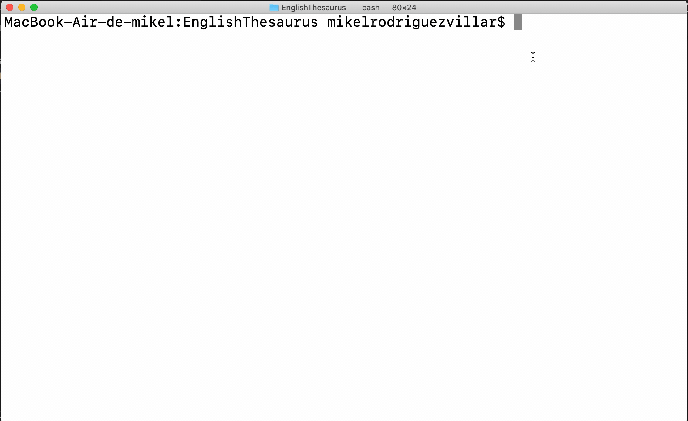

# English Thesaurus

Command Line Dictionary created for self-learning Python. It allows you to look up any English word and it provides all of their meanings. If the word doesn't exist it will tell you so. It also checks for mispellings, so it provides the closest word to the mispelled one as a suggestion.

# Technologies Used
1. Python3
2. JSON
3. Difflib

# Table of Contents
* [Features](#features)
* [Example Gif](#example-gif)

## Features
* It allows you to look up any English word and it provides all of their meanings.
* If the word doesn't exist it will tell you so.
* It provides the closest possible word as a suggestion for mispellings.

## Example Gif
